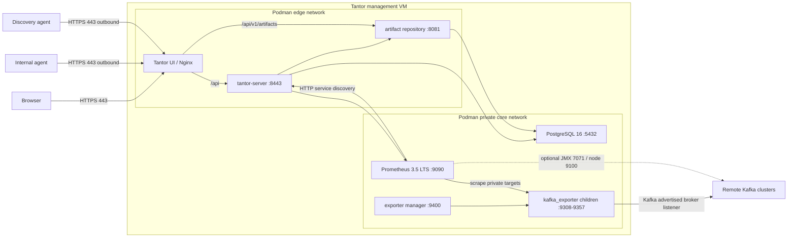

# Tantor V1 Podman Production Architecture

Status: implementation-approved architecture for Tantor V1  
Target scale: 20-30 Kafka clusters per management VM  
Deployment model: air-gapped, single management VM, Podman Quadlet  
Assumed host: RHEL 9-compatible x86_64 Linux with cgroup v2

## 1. Decision

Tantor V1 will run the complete management platform in Podman. Application
containers will not run systemd and will not access host systemd or the Podman
socket.

Kafka exporter lifecycle will be moved out of `tantor-server` into one
dedicated `tantor-exporter-manager` container. For every active Kafka cluster,
the manager starts one `kafka_exporter` child process inside its container.

At the V1 limit of 30 clusters this produces:

- 6 long-running application containers;
- at most 30 `kafka_exporter` child processes;
- one private exporter port per active cluster;
- no exporter ports published on the management VM;
- no exporter containers created dynamically;
- no systemd running inside any container.

Docker is not required. Podman Quadlet provides declarative, systemd-managed
container startup on the host.

## 2. V1 scope and explicit limits

### Supported

- One management VM.
- One active `tantor-server` instance.
- One exporter-manager instance.
- 20 clusters expected, 30 clusters tested and supported.
- A reserved maximum of 50 exporter assignments per manager.
- Kafka PLAINTEXT, TLS, SASL/PLAIN, SCRAM-SHA-256 and SCRAM-SHA-512 according
  to the capabilities already supported by the backend and Kafka Exporter.
- Internal agent and discovery agent communicating outbound through the
  management HTTPS endpoint.
- Offline installation, upgrade, backup and rollback.

### Not supported in V1

- More than 50 clusters on one exporter manager.
- Multiple active backend replicas.
- Automatic exporter-manager sharding.
- Kubernetes deployment.
- Giving a container access to `/run/podman/podman.sock`.
- Running systemd inside a container.
- Building Maven, npm, Go or container artifacts on the air-gapped VM.

The data model must include `manager_id` so that V2 can add two or more
exporter-manager shards without changing target identity.

## 3. Architecture



Only Nginx is published externally. Database, backend, repository, Prometheus,
exporter-manager API and exporter metrics ports remain private.

## 4. Components and responsibilities

| Component | Responsibility | Runtime |
|---|---|---|
| `tantor-ui` | Static UI, TLS termination and reverse proxy | Nginx container |
| `tantor-server` | API, authentication, desired monitoring state and Prometheus queries | Java 21 container |
| `tantor-artifact-repository` | Artifact metadata and downloads | Java 21 container |
| `database` | Durable application state | PostgreSQL 16 container |
| `prometheus` | Metrics scraping, storage and queries | Prometheus container |
| `tantor-exporter-manager` | Reconcile and supervise per-cluster exporters | Non-root Go service container |
| `kafka_exporter` | Collect metrics from one logical Kafka cluster | Child process of exporter manager |

The database and backend are the source of desired state. The exporter manager
is the source of observed runtime state. Prometheus is not used as the source of
exporter lifecycle state.

## 5. Network and firewall contract

### Inbound to management VM

| Source | Destination | Port | Required | Purpose |
|---|---|---:|---|---|
| Browsers | Management VM | TCP 443 | Yes | UI and API |
| Agent VMs | Management VM | TCP 443 | Yes | Heartbeat, polling and artifact download |
| Administrators | Management VM | TCP 22 | Operational | SSH administration |
| Browsers | Management VM | TCP 80 | Optional | Redirect to HTTPS only |

Ports 5432, 8081, 8443, 9090, 9308-9357 and 9400 must not be exposed on an
external host interface.

### Outbound from management VM

| Source | Destination | Port | Purpose |
|---|---|---:|---|
| Exporter manager | Kafka broker nodes | Configured advertised broker listener, commonly TCP 9092 | Kafka metadata and metrics |
| Prometheus | Kafka nodes | TCP 7071, if enabled | JMX Exporter scrape |
| Prometheus | Kafka nodes | TCP 9100, if enabled | Node Exporter scrape |
| Management services | DNS/NTP/internal CA services | Environment-specific | Infrastructure dependencies |

Kafka controller-only ports such as KRaft 9093 are not required by
`kafka_exporter` unless they are also configured as advertised broker
listeners.

### Agent networking

- Agents initiate outbound HTTPS connections to the management endpoint.
- No inbound agent port is required for task polling or heartbeat.
- Artifact URLs given to agents must use the externally reachable management
  DNS name, never `localhost` and never a container-only hostname.
- Nginx proxies artifact requests to the private repository container.

## 6. Exporter-manager design

Create a new top-level service named `tantor-exporter-manager`.

### Process model

- The Go manager is PID 1 in its container.
- The manager runs as a fixed non-root UID/GID.
- It starts `/usr/local/bin/kafka_exporter` directly with `exec.Command`.
- It never executes `/bin/sh`, `bash`, `systemctl`, `podman` or `docker`.
- It keeps a map keyed by cluster UUID containing process, port, config
  version, start time, restart count and last error.
- Every child is waited on and reaped.
- Unexpected exits use capped exponential restart backoff with jitter.
- SIGTERM stops reconciliation, terminates children, waits for a grace period
  and then force-kills remaining children before exiting.
- Logs are prefixed with the cluster UUID and written to stdout/stderr.

### Container security

- No Podman socket mount.
- No privileged mode.
- Drop all Linux capabilities.
- `no-new-privileges` enabled.
- Read-only root filesystem.
- Writable tmpfs only for runtime files.
- SELinux labels preserved on mounted volumes.
- Private internal networks only; port 9400 and exporter ports are not
  published to the host.
- Resource and PID limits are declared in Quadlet.

### Credentials

- The backend retains encrypted credentials as the authoritative store.
- The manager receives decrypted runtime credentials only through the private,
  authenticated desired-state endpoint.
- The manager must not persist passwords in plaintext.
- Kafka Exporter v1.9.0 receives the password only through the child
  environment variable `SASL_USER_PASSWORD`.
- `--sasl.password` must never appear in child arguments.
- Logs, errors, health responses and config fingerprints must redact secrets.
- TLS files are stored in a dedicated shared security volume: backend read/write,
  exporter manager read-only. Paths must be constrained below the mounted
  security root and must not accept `..` traversal or arbitrary host paths.

### Reconciliation protocol

The manager pulls a complete desired-state snapshot from the backend every 15
seconds:

```http
GET /internal/v1/monitoring/exporters/desired
Authorization: Bearer <service-token>
```

The response contains a monotonic generation and one record per desired
exporter:

```json
{
  "generation": 42,
  "exporters": [
    {
      "clusterId": "uuid",
      "managerId": "exporter-manager-1",
      "configVersion": 7,
      "port": 9308,
      "bootstrapServers": ["broker1:9092", "broker2:9092"],
      "kafkaVersion": "3.9.1",
      "security": {
        "protocol": "SASL_SSL",
        "saslEnabled": true,
        "saslUsername": "monitoring-user",
        "saslPassword": "runtime-only-secret",
        "saslMechanism": "scram-sha512",
        "tlsEnabled": true,
        "caFile": "/var/lib/tantor/security/uuid/ca.pem",
        "certFile": null,
        "keyFile": null
      }
    }
  ]
}
```

Rules:

1. Validate the entire snapshot before applying it.
2. Reject duplicate cluster IDs, duplicate `(managerId, port)` pairs, invalid
   ports, unsafe paths and unsupported security combinations.
3. Start missing desired exporters.
4. Restart an exporter only when `configVersion` changes or its process exits.
5. Stop exporters absent from a successfully validated complete snapshot.
6. If the backend request fails or the snapshot is invalid, keep currently
   running exporters. Never interpret a failed request as an empty desired set.
7. Publish observations back to the backend in batches:

```http
POST /internal/v1/monitoring/exporters/observations
```

Observation states are `STARTING`, `RUNNING`, `BACKING_OFF`, `FAILED`,
`STOPPING` and `STOPPED`.

The service token is loaded from a Podman secret or a root-owned mounted file,
not embedded in an image or Quadlet file.

### Health endpoints

- `/health/live`: manager event loop is alive.
- `/health/ready`: initial desired-state snapshot has been applied.
- `/v1/status`: authenticated internal summary without credentials.
- Manager-level Prometheus metrics on port 9400 include exporter counts,
  restarts, reconciliation failures and snapshot generation.

## 7. Database and port allocation

Do not use UUID hashing, `MAX(port) + 1`, or Java `synchronized` for port
allocation.

Add a Flyway migration creating a dedicated assignment table:

```sql
CREATE TABLE kf_exporter_assignments (
    cluster_id UUID PRIMARY KEY,
    manager_id VARCHAR(64) NOT NULL DEFAULT 'exporter-manager-1',
    port INTEGER NOT NULL,
    desired_state VARCHAR(16) NOT NULL,
    observed_state VARCHAR(16) NOT NULL DEFAULT 'STOPPED',
    config_version BIGINT NOT NULL DEFAULT 1,
    last_error TEXT,
    observed_at TIMESTAMPTZ,
    created_at TIMESTAMPTZ NOT NULL DEFAULT now(),
    updated_at TIMESTAMPTZ NOT NULL DEFAULT now(),
    CONSTRAINT uq_exporter_manager_port UNIQUE (manager_id, port),
    CONSTRAINT ck_exporter_port_range CHECK (port BETWEEN 9308 AND 9357)
);
```

Adapt naming and foreign-key behavior to the existing schema after inspecting
the real migrations. Do not cascade-delete the assignment before runtime
cleanup is acknowledged.

### Allocation transaction

1. Start a database transaction.
2. Acquire a PostgreSQL transaction advisory lock dedicated to exporter port
   allocation.
3. Return the existing assignment if the cluster already has one.
4. Select all used ports for `exporter-manager-1`.
5. Choose the lowest available port from 9308-9357.
6. Insert the assignment and commit.
7. Treat the unique constraint as the final collision guard.
8. Return a clear capacity error if all 50 ports are assigned.

The existing `Cluster.kafkaExporterPort` behavior must be migrated without
silently changing a collision-free current port. There must be one canonical
source after migration; do not maintain two independently writable port fields.

### Deletion and port release

1. Mark the assignment `desired_state=STOPPED`.
2. Keep the port reserved.
3. Manager stops the child and reports `observed_state=STOPPED`.
4. Backend deletes/releases the assignment only after the observation.
5. A scheduled cleanup retries incomplete shutdowns.
6. Force deletion still creates a STOPPED tombstone; it must not bypass runtime
   cleanup.

Cleanup must cover external deletion, normal managed deletion, force deletion,
clusters with no host assignment and asynchronous `DELETE_CLUSTER` completion.

## 8. Prometheus integration

- Use Prometheus 3.5.2 for the V1 baseline, pinned by image digest.
- Store TSDB data in a named persistent volume.
- Default scrape interval: 30 seconds.
- Default scrape timeout: 10 seconds.
- Default retention: 15 days, configurable.
- Backend HTTP service discovery returns targets in the form
  `exporter-manager-1:<assigned-port>` with stable `cluster_id`, `cluster_name`
  and environment labels.
- The manager container and Prometheus share the private core network.
- Exporter ports are not published on the host.
- Topic and consumer-group include/exclude filters are configurable per cluster
  to control metric cardinality.
- `concurrent.enable` stays disabled by default; enabling it requires a load
  test for the affected cluster.

Prometheus target discovery must continue reporting desired targets even when
an exporter is starting or failed, so `up=0` remains visible.

## 9. Container and application configuration

### Public gateway

- Nginx publishes TCP 443.
- Port 80 is optional and redirects to 443.
- Certificates come from the organization's internal CA and are mounted
  read-only.
- `/api` proxies to `tantor-server:8443` on the private network.
- `/api/v1/artifacts` proxies to `tantor-artifact-repository:8081`.
- Security headers, request-size limits and timeouts are explicit.
- `TANTOR_REPO_URL` uses the public management URL so agent tasks never contain
  `localhost` or container DNS names.

### Backend

- Remove all direct writes to `/etc/systemd/system`.
- Remove all `systemctl` execution in container mode.
- Add `TANTOR_EXPORTER_RUNTIME=manager`.
- Add manager ID, port range, reconciliation token and security-volume root
  configuration.
- Keep a `disabled` mode for tests and a separately maintained `systemd` mode
  only if native deployments must remain supported.
- Produce and verify a runnable Spring Boot fat JAR containing `BOOT-INF`.

### Artifact repository

- Supply `TANTOR_DB_URL=jdbc:postgresql://database:5432/tantor` and database
  credentials.
- Persist artifact files in a named volume.
- Do not publish port 8081 on the host.

### Database

- New V1 installations use PostgreSQL 16.14, pinned by digest.
- PostgreSQL 13 is not approved for a new production installation because it is
  end-of-life.
- Existing PostgreSQL 13 data requires a tested dump/restore or supported major
  upgrade procedure before production rollout.
- Database credentials use Podman secrets or root-owned files.
- Health checks must use the configured application database and user.

## 10. Version and artifact baseline

| Component | V1 baseline | Pinning requirement |
|---|---|---|
| Host OS | RHEL 9-compatible x86_64 | Exact supported release documented |
| Podman | Vendor-supported release with Quadlet and cgroup v2; minimum feature baseline 4.6 | Bundle exact RPM set/version |
| Java | Java 21 LTS runtime | Exact vendor build and SHA-256 |
| Tantor backend | 1.0.0 initially | Image digest and application build manifest |
| Artifact repository | 1.0.0 initially | Image digest and application build manifest |
| PostgreSQL | 16.14 | Image digest |
| Prometheus | 3.5.2 LTS | Image digest |
| Kafka Exporter | 1.9.0 | Binary SHA-256 and manager image digest |
| Nginx/UI image | Project-approved supported build | Image digest |
| Internal/discovery agents | Project release version | Binary SHA-256 per OS/architecture |

Never deploy `latest`, an unqualified image name, or a tag without recording
the resolved digest in the release manifest.

## 11. Initial capacity plan

Sizing depends primarily on topics, partitions, consumer groups, JMX metrics
and retention, not only cluster count. The following is the starting production
profile for 20-30 moderately sized clusters and must be validated by the load
test:

| Resource | Initial production recommendation |
|---|---:|
| Management VM CPU | 16 vCPU |
| Management VM RAM | 32 GB |
| OS disk | 100 GB SSD |
| Application/data disk | 500 GB SSD minimum |
| Backup capacity | Separate capacity equal to DB + artifact data, plus configuration |
| Exporter manager limit | 4 vCPU, 6-8 GB RAM, PID limit at least 256 |
| Prometheus allocation | 4-6 vCPU, 8-12 GB RAM |
| Backend allocation | 2-4 vCPU, 4 GB RAM |
| PostgreSQL allocation | 2-4 vCPU, 4-8 GB RAM |

Use a 1 TB data disk instead of 500 GB when enabling broad JMX/node metrics or
retention beyond 15 days. Final Prometheus disk sizing must be based on measured
active series and ingestion rate from a representative 30-cluster test.

If exporter-manager CPU stays above 70%, memory above 75%, or restart latency
exceeds the acceptance threshold, split into two manager containers with 15
clusters each before release rather than increasing limits blindly.

## 12. Failure and recovery behavior

| Failure | Expected result |
|---|---|
| One child exporter exits | Manager restarts only that child with backoff |
| Exporter manager restarts | All child processes stop; manager recreates desired exporters after backend becomes available |
| Backend unavailable | Manager keeps existing children; it does not treat failed reconciliation as empty state |
| Prometheus restarts | TSDB volume is retained; scraping resumes |
| PostgreSQL restarts | Backend/repository retry and recover without data loss |
| Management VM reboots | Quadlet/systemd starts services in dependency order and health checks gate readiness |
| Cluster is deleted | Exporter stops, STOPPED is acknowledged, then the port is released |
| Invalid new exporter config | Existing healthy configuration remains running; error is reported without secret leakage |

V1 is not highly available. Failure of the management VM interrupts Tantor UI,
management and monitoring, but must not stop or alter running Kafka clusters.

## 13. Air-gapped deployment bundle

Produce one immutable management bundle per OS/architecture:

```text
tantor-v1.0.0-rhel9-x86_64.tar.gz
├── install.sh
├── upgrade.sh
├── rollback.sh
├── backup.sh
├── restore.sh
├── preflight.sh
├── SHA256SUMS
├── manifest.lock.json
├── images/
│   ├── tantor-ui.oci.tar
│   ├── tantor-server.oci.tar
│   ├── tantor-artifact-repository.oci.tar
│   ├── tantor-exporter-manager.oci.tar
│   ├── postgres-16.14.oci.tar
│   └── prometheus-3.5.2.oci.tar
├── quadlet/
│   ├── network and volume definitions
│   └── one .container definition per service
├── config/
│   ├── tantor.env.example
│   ├── prometheus.yml
│   └── nginx.conf
├── migrations/
├── certificates/
└── agent-bundles/
```

`manifest.lock.json` records product version, source commit, build timestamp,
target OS/architecture, image digests, binary hashes, dependency versions and
SBOM locations.

### Installer contract

The installer must be idempotent and must:

1. Verify every file against `SHA256SUMS` before changing the host.
2. Validate OS, architecture, cgroup v2, Podman/Quadlet compatibility, CPU,
   RAM, disk, time synchronization, DNS and ports.
3. Refuse an unsupported environment with actionable messages.
4. Load OCI images without contacting a registry.
5. Verify loaded image digests against the manifest.
6. Create configuration, secret, certificate and data directories with
   restrictive ownership and permissions.
7. Install Quadlet definitions declaratively.
8. Initialize a new database or perform a separately approved upgrade path.
9. Start services in dependency order with health checks.
10. Run an end-to-end smoke test through HTTPS.
11. Print service status, public URL, log commands and backup instructions.
12. Roll back application definitions when a critical health check fails;
    database rollback requires the documented database restore procedure.

Installation must be proven while outbound internet access is disabled.

## 14. Repository change map

### Backend

- `tantor-server/src/main/java/io/translab/tantor/server/service/PrometheusMonitoringService.java`
  - remove systemd behavior from manager mode;
  - read canonical assignments;
  - generate Prometheus targets using manager hostname and assigned port;
  - never put SASL passwords in command-line plans.
- Add exporter assignment entity, repository, allocation service and lifecycle
  service.
- Add authenticated desired-snapshot and observation endpoints under
  `/internal/v1/monitoring/exporters`.
- Update `ExternalClusterService`, `AgentService` and every normal/force delete
  path to request STOPPED desired state rather than deleting runtime state.
- Add Flyway migration and concurrency tests.
- Make fat-JAR packaging part of the verified build.

### Exporter manager

- Add new `tantor-exporter-manager/` Go module.
- Implement configuration validation, reconciliation, child supervision,
  secret redaction, health/metrics endpoints, shutdown and tests.
- Package Kafka Exporter v1.9.0 with verified SHA-256.

### UI gateway

- Update `tantor-ui/nginx.conf` for HTTPS, backend proxy and artifact proxy.
- Keep internal service names configurable at image build or startup template
  time.

### Deployment

- Keep `podman-compose.yml` only as a developer convenience if desired.
- Production deployment uses checked-in Quadlet definitions.
- Add private networks, named volumes, health checks, resource limits,
  read-only filesystems and secrets.
- Add Prometheus configuration with backend HTTP service discovery.
- Add offline packaging, install, upgrade, backup, restore and validation
  scripts.

## 15. Implementation sequence

1. Capture current behavior and add regression tests.
2. Fix and verify runnable backend/repository artifacts.
3. Add database assignment model, unique constraint and transactional allocator.
4. Add backend desired-state and observation APIs with service authentication.
5. Implement exporter manager and its unit tests.
6. Change Prometheus target generation to manager hostname plus assigned port.
7. Connect cluster create/update/delete lifecycle to desired state.
8. Add integration tests with two test Kafka clusters, including SASL/TLS.
9. Add production Quadlet deployment and private networking.
10. Add HTTPS gateway and externally reachable artifact URLs.
11. Add offline bundle and idempotent installer.
12. Execute 30-cluster load, failure, security, reboot and offline tests.
13. Produce the final BOM, SBOM, checksums, operations runbook and rollback
    evidence.

Each step must leave the repository buildable and tested. Do not combine the
entire migration into one unreviewable change.

## 16. Release acceptance gates

The architecture is accepted only when all of the following pass:

### Functional

- Thirty clusters can be registered concurrently without duplicate ports.
- Every exporter becomes a Prometheus target within 60 seconds.
- Metrics for each target contain the correct cluster identity.
- Cluster configuration changes restart only the affected exporter.
- All normal and force deletion paths stop the exporter and safely release its
  assignment.
- Capacity exhaustion returns a clear error and does not corrupt assignments.

### Recovery

- Killing one exporter causes an automatic recovery within 30 seconds after
  backoff.
- Restarting exporter manager recreates all 30 desired exporters within 120
  seconds after backend availability.
- Backend outage does not cause the manager to stop healthy exporters.
- Full VM reboot returns all services to healthy state without manual steps.
- PostgreSQL backup and restore are demonstrated.

### Security

- No Kafka password appears in `ps`, `/proc/<pid>/cmdline`, container
  configuration, logs, API errors or Prometheus labels.
- No container is privileged or has the Podman socket mounted.
- Only ports 443, optional 80 and administrative 22 are externally listening.
- Internal manager endpoints reject missing/invalid service authentication.
- Path traversal, malformed UUID, duplicate port and command-injection tests
  pass.
- Images and binaries match the locked digests/hashes and have an SBOM and
  vulnerability-review record.

### Performance

- Run a representative 30-cluster workload continuously for at least 24 hours.
- Prometheus scrape success is at least 99% excluding deliberately failed
  targets.
- No OOM kill, unbounded goroutine/process growth or crash loop occurs.
- Sustained CPU remains below 70% and memory below 75% of assigned limits.
- Measured Prometheus ingestion and disk growth support the configured
  retention with at least 30% free-space margin.

### Air gap

- A clean VM with outbound internet blocked installs successfully from the
  bundle.
- Reinstall is idempotent and preserves data.
- Upgrade and rollback are demonstrated without downloading anything.

## 17. Go/no-go decision

V1 may ship on this architecture when the acceptance gates above pass for 30
clusters. If they do not pass, do not work around failures by granting
privileged container access, mounting the Podman socket, running systemd in a
container or exposing exporter ports publicly. Fix the lifecycle implementation
or split the manager into two statically assigned shards.

## 18. Anti-Gravity implementation instruction

Use the following instruction with this document attached or available in the
repository:

> Implement `docs/v1-podman-production-architecture.md` as the authoritative
> Tantor V1 deployment architecture. The target is 20 expected and 30 supported
> Kafka clusters on one RHEL 9-compatible x86_64 management VM. Use Podman
> Quadlet for production. Do not run systemd inside containers, do not mount the
> Podman socket, do not run privileged containers, and do not dynamically create
> one container per Kafka cluster. Create a non-root
> `tantor-exporter-manager` service that directly supervises one Kafka Exporter
> v1.9.0 child process per active cluster and reconciles against an authenticated
> complete desired-state snapshot from the backend. Implement the database
> assignment model, transactional port allocator, lifecycle acknowledgements,
> deletion coverage, Prometheus discovery, private networking, HTTPS gateway,
> PostgreSQL 16 migration, Quadlet deployment and offline bundle exactly as
> specified. Preserve unrelated user changes. Work incrementally in the listed
> implementation sequence, run relevant tests after every phase, and report
> actual commands and results. Never claim an artifact is pinned or runnable
> without showing its digest/manifest evidence. Do not weaken a release
> acceptance gate to make a test pass. If a repository fact conflicts with this
> plan, stop that specific change, document the evidence and propose the
> smallest safe adjustment before proceeding. Complete the implementation,
> tests, air-gap package and operations documentation; do not stop after writing
> another feasibility report.
